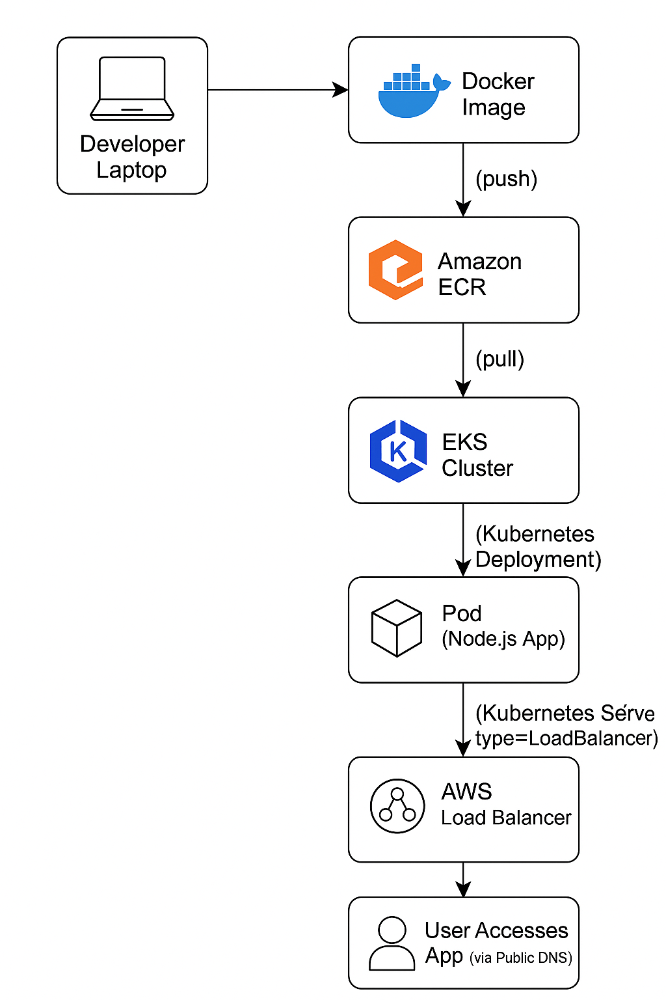

# Step-by-Step Guide: Deploy a Node.js App to EKS with Fargate and ALB



## Build and Deploy an autoscaling Node.js and MongoDB API using Docker, and Kubernetes.

### Containerization and orchestration have become vital in modern application development for efficient deployment and management of scalable applications. Leading the pack, Docker and Kubernetes provide a powerful combination, enabling seamless packaging, deployment, and scaling of applications.

### In this tutorial, Specifically, we will focus on building and deploying an autoscaling Todo API built with Node.js, Express.js, and MongoDB. We’ll explore the step-by-step process of setting up a local Kubernetes environment, containerizing the Node.js application using Docker, and configuring a Kubernetes autoscaling deployment for our application


## Prerequisites:
 1. Node.js :  Ensure that you have Node.js installed on your machine.
 2. Docker : Install Docker on your machine to containerize and manage your application.
 3. Kubernetes: make sure to familiarize yourself with the basic components of Kubernetes. 
 4. AWS ECR : AWS image registry that helps to storage the docker image
 5. AWS EKS : Kubernetes cluster where we deploy node application.  
 6. Kubectl : install Kubectl, a command line tool for communicating with a Kubernetes  
    cluster using the Kubernetes API.


First, clone the repository or simple node app ready.


Next, let’s containerize our app using Docker. A Dockerfile is a text file that contains a set of instructions used to build a Docker image. It defines the steps needed to create a self-contained environment for running your application.

## Build and push image to AWS ECR Registry

In order for the Kubernetes cluster to pull the Docker image of our application during deployment, we need to make the image accessible. This can be done in various ways, one way is by pushing the docker image to a ECR registry, which can be a public, private, or local registry.

 To do that, Make sure you have installed:

 1.AWS CLI (v2 recommended)

 2.Docker installed and running

 3.AWS CLI configured with your credentials:


## 1. Configure AWS CLI
```bash
aws configure
```
Provide:
- AWS Access Key
- AWS Secret Key
- Region (example: `us-east-1`)

✅ Now your CLI is connected to AWS.

## 2. Create ECR Repository

 ```bash 
 aws ecr create-repository --repository-name test-kuber --region your-region 
 ```

## 3. Authenticate Docker to ECR 
 
 ```bash 
    aws ecr get-login-password --region us-east-1 | docker login --username AWS 
    --password-stdin <Account-ID>.dkr.ecr.us-east-1.amazonaws.com
```

## 4. lets build the image and tag it 
 
  ### Build a Docker image 

  ```bash
docker build -t kubernetes-app .
```

  ### Tag image for ECR

   ``` bash 
   docker tag "image":latest <your-account-id>.dkr.ecr.us-east-1.amazonaws.com/ 
      "ECR Repository":latest 
   ```

## 5. Push to ECR

  ```bash 
  docker push <your-account-id>.dkr.ecr.us-east-1.amazonaws.com/"ECR Repo":latest
```

**This guide walks you through setting up an AWS EKS cluster with Fargate profiles, installing the AWS Load Balancer Controller, deploying a Node.js app, and accessing it publicly via ALB.**

---

## Table of Contents

- [1. Install CLI Tools](#1-install-cli-tools)
- [2. Create EKS Cluster with Fargate](#3-create-eks-cluster-with-fargate)
- [3. Create Fargate Profile](#4-create-fargate-profile)
- [4. Connect kubectl to EKS](#5-connect-kubectl-to-eks)
- [5. Install AWS Load Balancer Controller](#6-install-aws-load-balancer-controller)
- [6. Create Kubernetes Resources for Node.js App](#7-create-kubernetes-resources-for-nodejs-app)
- [7. Apply Kubernetes Manifests](#8-apply-kubernetes-manifests)
- [8. Access Node.js App via ALB](#9-access-nodejs-app-via-alb)

---

## 1. Install CLI Tools

### 1.1 Install AWS CLI
```bash
brew install awscli
```
A command-line tool to manage AWS services like EC2, S3, IAM, EKS, CloudFormation, etc.

### 1.2 Install kubectl
```bash
brew install kubectl
```
kubectl is the command-line tool to interact with Kubernetes clusters.

### 1.3 Install eksctl
```bash
brew install eksctl
```
eksctl is a command-line tool that makes it easy to create, manage, and delete AWS EKS (Elastic Kubernetes Service) clusters.

---

## 2. Create EKS Cluster with Fargate
```bash
eksctl create cluster --name nodejs-cluster --region us-east-1 --fargate
```
Creates EKS cluster, VPC, subnets, route tables, IAM roles, and a default Fargate profile.

---

## 3. Create Fargate Profile
```bash
eksctl create fargateprofile --cluster nodejs-cluster --name nodejs-profile --namespace nodejs
```
✅ Pods in `nodejs` namespace will automatically run on Fargate.

---

## 4. Connect kubectl to EKS
```bash
aws eks update-kubeconfig --region us-east-1 --name nodejs-cluster
```
✅ This configures kubectl to connect to your cluster.

---

## 5. Install AWS Load Balancer Controller

### 5.1 Create OIDC Provider
```bash
eksctl utils associate-iam-oidc-provider --cluster nodejs-cluster --approve
```

### 5.2 Create IAM Policy
```bash
curl -o iam_policy.json https://raw.githubusercontent.com/kubernetes-sigs/aws-load-balancer-controller/main/docs/install/iam_policy.json

aws iam create-policy \
  --policy-name AWSLoadBalancerControllerIAMPolicy \
  --policy-document file://iam_policy.json
```
First command links your EKS cluster to an AWS IAM OIDC provider, allowing secure pod-level access to AWS services via IAM roles.
 You need this if you want to give AWS permissions (like S3, DynamoDB, SQS access) to pods running inside your EKS cluster.

Then Create IAM Policy:

 When you install the AWS Load Balancer Controller (for ALB/ELB Ingress):
    It needs AWS permissions to create and manage:
            Elastic Load Balancers (ALB/NLB)
            Target groups
            Listener rules
            Security groups  
  Kubernetes pods cannot directly have AWS permissions.
  Instead, the pod assumes an IAM Role (using IRSA and OIDC) — this IAM Role must have this policy attached.

        ✅ That's why you create this custom IAM Policy.

### 5.3 Create Service Account
```bash
eksctl create iamserviceaccount \
  --cluster nodejs-cluster \
  --namespace kube-system \
  --name aws-load-balancer-controller \
  --attach-policy-arn arn:aws:iam::<your-account-id>:policy/AWSLoadBalancerControllerIAMPolicy \
  --approve
```
Here creating a service account, and attaching IAM role 
    So when the Load Balancer Controller pod runs using this service account, it automatically gets AWS permissions without needing access keys!
    This command sets up the link between a Kubernetes service account and an IAM role, so the Load Balancer Controller pods can securely access AWS APIs.

### 5.4 Install Controller using Helm
```bash
helm repo add eks https://aws.github.io/eks-charts
helm repo update

helm install aws-load-balancer-controller eks/aws-load-balancer-controller \
  -n kube-system \
  --set clusterName=nodejs-cluster \
  --set serviceAccount.create=false \
  --set serviceAccount.name=aws-load-balancer-controller \
  --set region=us-east-1 \
  --set vpcId=<your-vpc-id>
```

✅ Load Balancer Controller is now running!

---

## 6. Create Kubernetes Resources for Node.js App

- `deployment.yaml`: Pulls Node.js image from ECR.
- `service.yaml`: Exposes app inside the cluster.
- `ingress.yaml`: Creates ALB and routes external traffic.

---

## 7. Apply Kubernetes Manifests
```bash
kubectl apply -f k8s/deployment.yaml
kubectl apply -f k8s/service.yaml
kubectl apply -f k8s/ingress.yaml
```

✅ Kubernetes will:
- Deploy Node.js app to Fargate
- Create an ALB
- Expose the app publicly

---

## 8. Access Node.js App via ALB
```bash
kubectl get ingress nodejs-ingress -n nodejs
```


Example output:
```plaintext
NAME             CLASS    HOSTS   ADDRESS                                                                PORTS   AGE
nodejs-ingress   <none>   *       k8s-nodejs-nodejsin-316c12bb94-2125159329.us-east-1.elb.amazonaws.com   80      30m

```
✅ Open the `ADDRESS` (ALB DNS name) in your browser.
✅ Your Node.js app is now LIVE! 🎉


---

# 🎯 Congratulations!

✅ You have successfully:
- Set up an EKS cluster with Fargate
- Installed AWS Load Balancer Controller
- Deployed your Node.js app
- Made it publicly accessible via ALB 🚀

---

# 📋 Final Tips
- Ensure your app responds with HTTP 200 OK on `/` path for ALB health checks.
- Use namespaces wisely for Fargate profiles.
- Monitor ALB Target Group health in AWS Console.

Happy Kubernetes-ing
